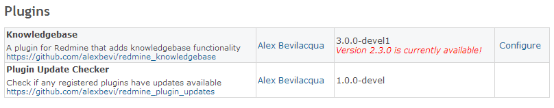

# Plugin Update Checker for Redmine

This plugin checks the currently registered plugins of a Redmine installation for updates.

The version checker currently supports plugins that are publicly hosted on:

* Github

Note that version numbers to be matched currently need to comply with the [Semantic Versioning](http://semver.org) standard.

## Making your Plugin Compatible

In order for the version checker to be able to accurately detect version information in an exernal plugin, that plugin needs to have a valid `version` field defined in the plugins **init.rb** file.

The plugin also needs to have a ``url`` field defined which points to a publicly hosted version of the plugin (Github, Bitbucket .. etc).

### Github

For projects that are hosted on Github, the version will be checked againt the **init.rb** file that is available on the *master* branch.

## Usage

This plugin overrides the built-in Redmine plugin settings screen, which is accessible via http://(redmine-url)/admin/plugins.

We're currently only doing a *string equality check*, so versions that are less than or greater than the currently installed version aren't being evaluated properly (TODO).

### Cheers

Thanks to Josh Lindsey for his [Semantic Version](https://github.com/jlindsey/semantic) class.